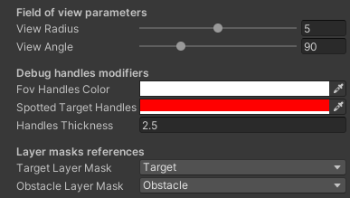
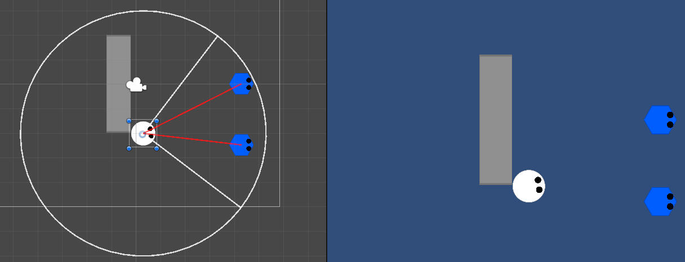

# TopDown_FOV
Character Field of View representation in 2D top-down perspective

## How it works:
1. Check for visible targets from target layer mask inside view radius.
2. If there is at least one target inside view radius, then calculate direction to it.
3. If the target is inside view angle, then calculate distance to it.
4. If player character don't collide with any objects from obstacle layer mask during raycasting, it means that the target is spotted.
5. Save target transform component in the array.
6. Draw debug line, which visualises distance between player character and spotted target.

- With each check, array of spotted target's transform components is being cleared to avoid duplicating.
- The check is delayed 0.2 seconds to increase performance

## Field of view editor tool

- View radius can be modified in range between 0 and 10.
- View angle can be modified in range of 360 degrees.
- Color of debug handles and their thickness can be easily changed.
- Layer mask corresponding to raycasting targets can be easily changed.

## Project Screenshot

