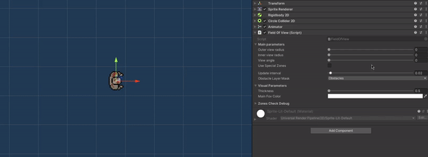

# Top-down AI sensor 2D
This is standalone version of my "Top-down Ai sensor 2D" that is included inside my [utils package](https://github.com/Skallu0711/Skallu-Utils), so it doesn't require any additional imports to work properly.

## Overview
Presented tool is an Ai sensor that is intended to be used in 2D top-down perspective environmewnts.
It contains its own custom editor to display all the modifiable parameters and the GUI to visualize character's field of view.

<p align="center">
 
</p>

## How it works
System performs cyclical operations by checking if selected target can be spotted by the character.

Spot check:
1. check the distance between target and character
2. check if the target is inside character's field of view
3. check if the target is not behind any obstacle

## Setup
1. attach "TopDownAiSensor2D" component to game object:
2. adjust values inside inspector to suit your needs
3. set target object via uinspector or inside "Awake" method
```csharp
 private void Awake()
 {
      if (targetObject == null)
      {
           // set target object here
           targetObject = GameObject.FindGameObjectWithTag("Player");
      }
 }
```
