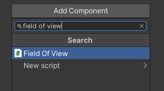
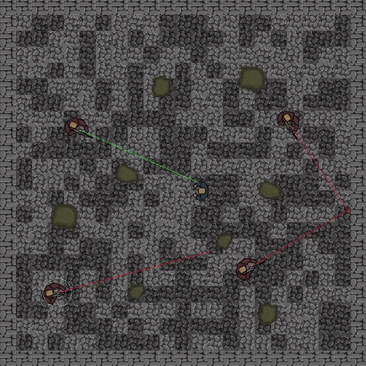

# Field of View tool
2D top-down perspective "Field of View" game mechanics tool.
Whole system is about performing cyclical check whether the target is inside character's field of view and its not covered by any obstacle.

Presented system has built-in editor tool, which visualises character's field of view by drawing debug circles and lines on scene.
Every parameter that makes up "Field of View" can be modified via inspector to suit Your needs.


## Setup
1. attach component to game object:


2. adjust values:


3. set target inside script:
```csharp
private void Awake()
    {
        // set target here
        // target = 
    }
```

## Usage Example:


## My package
Here is a link for my custom package, which i used in this project:
https://github.com/Skallu0711/Skallu-Utils
