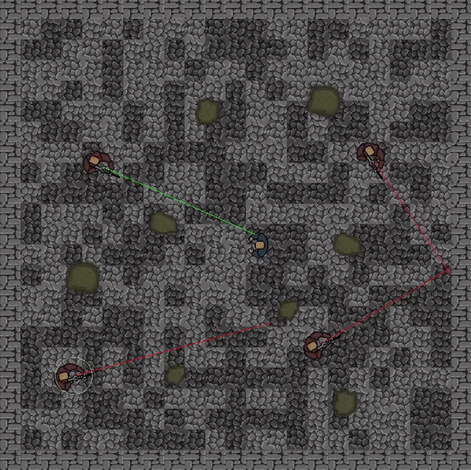

# 2D Top-Down Field of View
Simple 2D top-down perspective project which uses my implementation of character's "Field of View" mechanics.

## How does this "Field of View" work?
Script peforms cyclical operations of checking whether the target is inside the character's field of view.
Every "zone check" operation is is delayed by some time to increase performance. This value is modifiable via script.

The basic steps of "zone check":
1. Check if the target is inside outer view radius
2. Then check if it is inside inner view radius and if it is not behind any obstacle.
3. If target is inside outer view radius but outside the inner radius, check if its inside view angle, then check if it is not behind any obstacle.

[Click here to read more detailed informations about "Field of View" tool](Top_Down_FOV/Assets/Scripts/FOV/)

## My package
Here is a link for my custom package, which i used in this project:
https://github.com/Skallu0711/Skallu-Utils