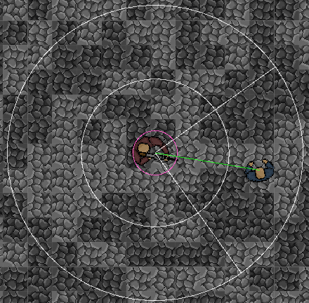
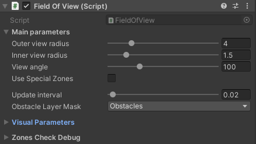

# Field of View
"Field of View" game mechanics tool designed to be used in 2D top-down perspective games.

## How does this mechanics work?
Script peforms cyclical operations of checking whether the target is inside the character's field of view.
Every "zone check" operation is is delayed by some time to increase performance. This value is modifiable via script.

The basic steps of "zone check":
1. Check if the target is inside outer view radius
2. Then check if it is inside inner view radius and if it is not behind any obstacle.
3. If target is inside outer view radius but outside the inner radius, check if its inside view angle, then check if it is not behind any obstacle.

## Setup guide
1. Set values that suit your needs inside inspector
2. Set game object that will be considered as target
```csharp

[HideInInspector] public GameObject target; // you can display this in inspector if You want to choose target manually

private void Awake()
{
    // set target here
    target = PlayerController.self.gameObject // get rid of this, if You are setting this via inspector
}
```

## Field of view editor tool overwiew
This script has its own custom editor tool that visualizes cahracter's field of view by drawing debug lines on scene.
Every parameter that makes up the "Field of View" can be modified via isnpector to suit Your needs.



Field Of View parameters:
- View outer radius - area that determines the ability to detect target within it, provided that they are also within the viewing angle cone
- View inner radius - the minimum area that determines the ability to detect target within it
- View angle - angle (in degrees), which determines the ability to spot objects within its area
- Safe zone radius - an optional area that can be used, e.g. to retreating, when target is too close
- Attack range radius - an optional area that can be used, e.g. to detect if a character is close enough to attack
- Zone check interval - time interval between zone checks (e.g. fov update).
- Cast radius - value of the circle cast radius
- Obstacle Layer mask - layer with all obstacles, which is used during circle cast

Field Of View handles parameters:
- Main Fov Color - color of the inner & outer view radiuses and view angle
- Safe Zone Color - color of the safe zone radius
- Attack Range Color - color of the attack range radius
- Thickness - thickness of the debug handles


